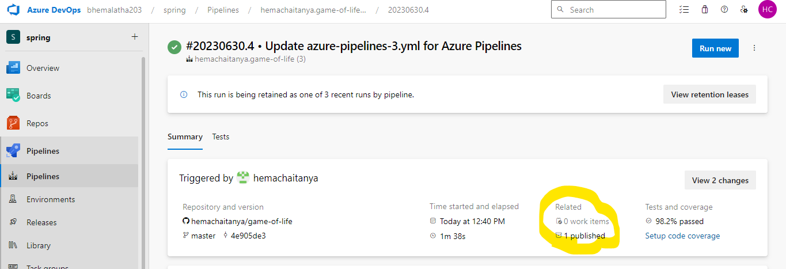
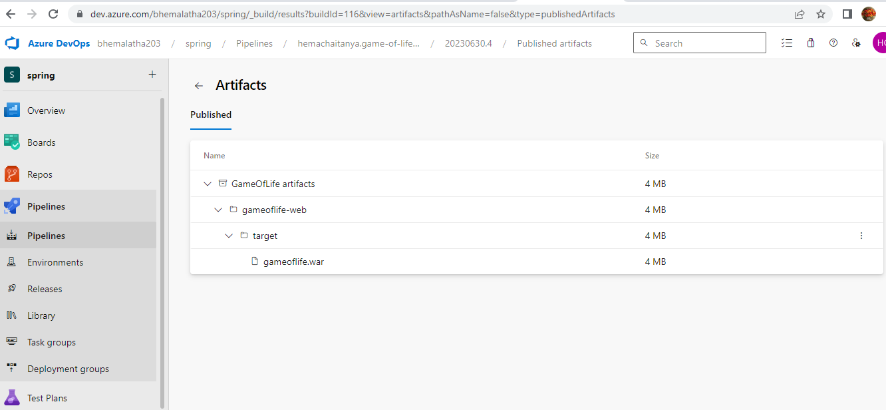

### programming language

Here is a detailed Azure DevOps pipeline for a Spring Boot application with at least 8 jobs inside the pipeline, using YAML syntax:

```
trigger:
- main

pool:
  vmImage: 'ubuntu-latest'

variables:
  artifactName: 'springboot-app'
  dockerRegistry: 'yourregistry'
  dockerRepository: 'yourrepository'
  dockerTag: 'latest'
  azureAppService: 'yourappservice'
  azureResourceGroup: 'yourresourcegroup'

stages:
- build
- unitTest
- codeAnalysis
- package
- integrationTest
- deployDev
- performanceTest
- deployProd

jobs:
  - job: build
    stage: build
    steps:
    - task: Maven@3
      displayName: 'Maven build'
      inputs:
        goals: 'package'
      outputs:
        artifactName: '$(artifactName)'

  - job: unitTest
    stage: unitTest
    steps:
    - task: Maven@3
      displayName: 'Maven test'
      inputs:
        goals: 'test'
      outputs:
        testResults: '$(artifactName)/surefire-reports/*.xml'

  - job: codeAnalysis
    stage: codeAnalysis
    steps:
    - task: SonarQubeAnalyze@4
      displayName: 'SonarQube analysis'
      inputs:
        sonarQubeConfig: 'sonar.properties'
      outputs:
        codeQualityReport: '$(artifactName)/sonar-report.json'

  - job: package
    stage: package
    steps:
    - task: Docker@2
      displayName: 'Docker build'
      inputs:
        command: 'build'
        Dockerfile: '**/Dockerfile'
      outputs:
        dockerImage: '$(dockerRegistry)/$(dockerRepository):$(dockerTag)'

  - job: integrationTest
    stage: integrationTest
    steps:
    - task: Docker@2
      displayName: 'Docker run'
      inputs:
        command: 'run'
        containerName: '$(artifactName)'
      outputs:
        testResults: '$(artifactName)/integration-test-reports/*.xml'

  - job: deployDev
    stage: deployDev
    steps:
    - task: AzureAppServiceDeploy@4
      displayName: 'Azure App Service deploy'
      inputs:
        azureResourceManagerConnection: $(azureAppService)
        appName: '$(azureAppService)'
        package: '$(artifactName)'

  - job: performanceTest
    stage: performanceTest
    steps:
    - task: JMeterTest@2
      displayName: 'JMeter test'
      inputs:
        testPlan: '$(artifactName)/performance-test-plan.jmx'
      outputs:
        performanceTestResults: '$(artifactName)/performance-test-results/*.xml'

  - job: deployProd
    stage: deployProd
    steps:
    - task: AzureAppServiceDeploy@4
      displayName: 'Azure App Service deploy'
      inputs:
        azureResourceManagerConnection: $(azureAppService)
        appName: '$(azureAppService)'
        package: '$(artifactName)'
```

This YAML pipeline definition includes eight jobs, each representing a stage in the pipeline. The jobs are:

1. Build: Compiles the Spring Boot application using Maven.
2. Unit Test: Runs unit tests using Maven.
3. Code Analysis: Performs code analysis using SonarQube.
4. Package: Builds a Docker image using the Dockerfile.
5. Integration Test: Runs integration tests using Docker.
6. Deploy Dev: Deploys the application to a development environment in Azure App Service.
7. Performance Test: Runs performance tests using JMeter.
8. Deploy Prod: Deploys the application to a production environment in Azure App Service.

Note that you need to replace the placeholders (`yourregistry`, `yourrepository`, `yourappservice`, `yourresourcegroup`) with your actual Azure DevOps and Azure resources.

* programming languages are three types
    * compailer language
#### compailer language
    * its used for converting high level programming language or machine level language to low level programming language
    (ex: java,ruby,etc)
    (ex: before the packaging it will be available(like dubbing for movie release in theater with different languages))

    * interpreter language
    
### variable
 <https://learn.microsoft.com/en-us/azure/devops/pipelines/process/variables?view=azure-devops&tabs=yaml%2Cbatch>

### parameters

<https://learn.microsoft.com/en-us/azure/devops/pipelines/build/variables?view=azure-devops&tabs=yaml>


#### interpreter language
    * its used as translater (it will convrting heigh level language to machine level language)

    * byte code languageguage
### Assembler
   * it will convert Assembly language to machine level lan

### commands
* sudo apt-cache search openjdk-17
* sudo apt-cache search maven
* sudo apt-cache 
* list users on ubuntu (less /etc/passwd)
* list ser groups (less /etc/group)
* Listing Logged In Users(w)
    #### Using APT to List Installed Packages on Ubuntu

    * sudo apt list –-installed | less
    * sudo apt list –-installed | grep PHP
    *  sudo apt packageName

    * Using dpkg-query to List Installed Packages on Ubuntu
     (sudo dpkg -l | grep packageName)

### how to change current host name in linux
#### 3 types to change local hosts
    * Option 1: hostnamectl (hostnamectl set-hostname hostname)

    *Option 2: Using the Network Manager Text User Interface (nmtui)
        sudo yum install NetworkManager-tui -y
        service NetworkManager status
        service NetworkManager start
        sudo nmtui
        * select set hostname and press enter , Type the desired hostname and choose OK.
    
    Option 3. Edit the Configuration Files
* 
cofiguration drift : difference b/w desired state and actual stage


### pool: 
 * pool: collection of agents(if u have multiple machines)

### Publish artifacts is used for to save the artifacts

```
---
trigger:
  - master
jobs:
  - job: "build gol"
    displayName: build maven package for gameoflife
    pool:
      name: Azure Pipelines
      vmImage: ubuntu-latest
    steps:
    - task: Maven@3
      inputs:
        mavenPOMFile: 'pom.xml'
        goals: 'package'
        publishJUnitResults: true
        testResultsFiles: '**/surefire-reports/TEST-*.xml'
        javaHomeOption: 'JDKVersion'
        jdkVersionOption: '1.8'
        mavenVersionOption: 'Default'
    - task: CopyFiles@2
      inputs:
        Contents: '**/target/gameoflife.war'
        TargetFolder: '$(build.artifactstagingdirectory)'
    - task: PublishBuildArtifacts@1
      inputs:
        PathtoPublish: '$(Build.ArtifactStagingDirectory)'
        ArtifactName: 'GameOfLife artifacts'
   
```



### azure devops classic pipelines
* 

### we want to give some approvel by using tasks

<https://learn.microsoft.com/en-us/azure/devops/pipelines/process/approvals?view=azure-devops&tabs=check-pass>
### you want to send notifications to emails by using azuredevops
<https://learn.microsoft.com/en-us/azure/devops/organizations/notifications/manage-team-group-global-organization-notifications?view=azure-devops>

### 


