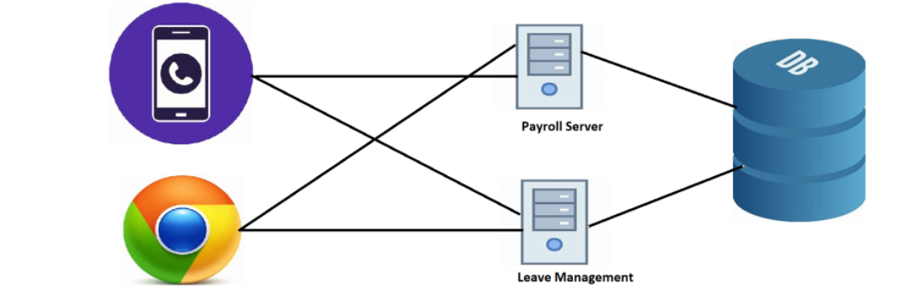
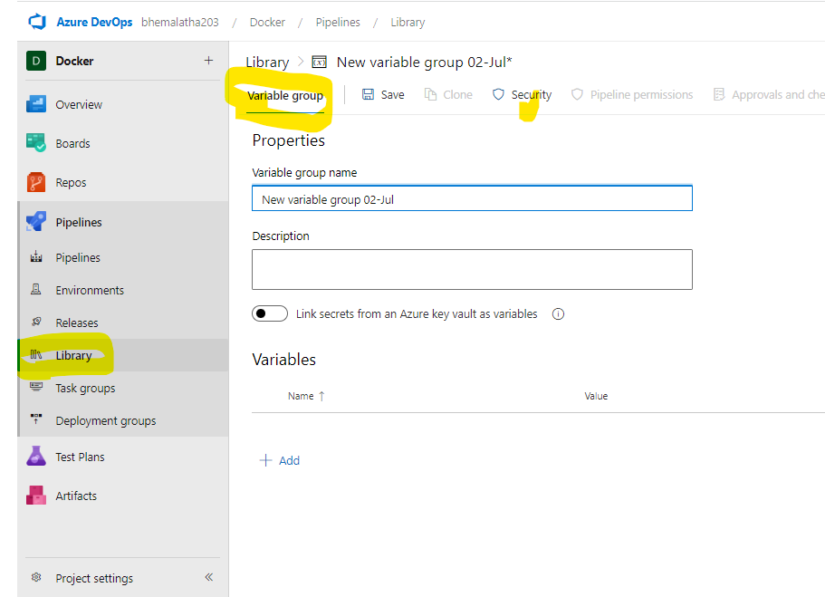

### azure devops

For developing this application we have following teams

* Payroll dev team

* LeaveMgmt dev team
* Browser UI team
* App UI team
* Duration: 1 year
* Clients:
  * coca cola
  * Amul

### Approach 1 (Big Bang integration):

* Each team will start devloping the components independently

* This has 4 teams working independently for 9 months

* Day 1 of 10th month, Integration of all the work done by independent teams 
will done by build/release team

* This approach is called as Big-Bang integration. This mostly fails and to fix the issues we will added lot of technical debt.

### Approach 2 (Continuous Integration)

* Each team will start devloping the components independently
This has 4 teams working independently for 9 months
* Day 1 of first month we start integration.

* In this approach the team can identify integration issues from day 1.
This is called as Continuous Integration

* For this to happen, we need tools rather than humans doing the integration.
Whenever any team submits code, the integration has to run

* Integration includes

* building the code

* packaging the application

* running basic automated tests which will tell health of the application.
The cost of fixing issues at different stages

### Agile Ways of Working

* There is a need to release the application frequently

* The need for automating releases increased

* What we need

* Tool for managing continous integrations as well as deployments (releases) to the customer.

*    A tool where developers can submit the code
*     A tool for managing the project
* What we are going to learn
     Agile (Scrum)
     Basic Git
     CI/CD pipelines in Azure DevOps
     Minimum Project management
     Boards
     Test Managements

      * mkdir myagent
      * cd myagent
      * wget https://vstsagentpackage.azureedge.net/agent/3.220.2/vsts-agent-linux-x64-3.220.2.tar.gz
      * tar zxvf vsts-agent-linux-x64-3.220.2.tar.gz
      * ./config.sh
          azuredevops url
          token
      * ./run.sh

### variables
 * name: one
   variable: initialvalue
   echo '$(one)'
   echo '${{ parameter.one }}'

### what is the difference between the variable and parameter

*  Variables are quantities which vary from individual to individual.

* By contrast, parameters do not relate to actual measurements or attributes but to quantities defining a theoretical model. 

* use parameters we choose options , for variables we git single value.
* variables are reusable
    built
    compalision
    test
    readonly= we can't cahnge
    secrete= sensible var.
* parameters arenot reusable.
*

*  

#### pipelines execution on  phases
  * 1 queue phase: agent execute for other job
  * 2 runtime: 
  * 3 compile: yaml is allowcated variables are executed or not 

#### variables can be used 3 different expressions
  * macro '$(var)'
  * templete '${{ variables.var}}'
  * script variables : it can be set from scripts '##vso[task.setvariables variable=myVAR]'  
  "we want to change new value we use set variables"

  <https://learn.microsoft.com/en-us/azure/devops/pipelines/process/variables?view=azure-devops&tabs=yaml%2Cbatch>

  *  i have 10 variables then we use  secrets and variables
  

  any sensible information we use in pipeline we use variable groups
  

